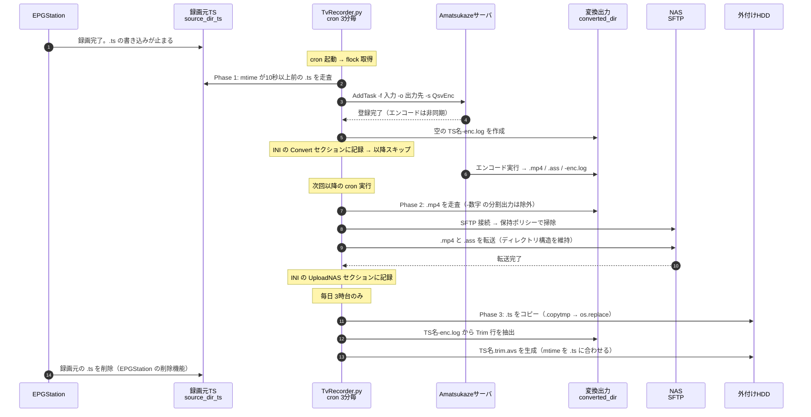

# tv_server_on_ubuntu_with_amatsukaze

Ubuntu 上で TV 録画サーバを **メンテナンスフリー** で運用するためのスクリプト集です。

録画後の「CM 抜き MP4 への変換 → NAS / HDD へのバックアップ → 古いファイルの自動削除」を
cron から無人で回し、ディスクが溢れないところまで自動化します。

構築の背景・ハードウェア選定・EPGStation / KonomiTV のセットアップ手順は下記の記事にまとめています。
本 README はリポジトリ内スクリプトの仕様と使い方に絞って記載します。

- https://simplelife.sabalog.com/it/tv_server_on_ubuntu_with_amatsukaze/

## システム構成

| 役割 | 使用ソフト / 機器 |
|---|---|
| 録画 | EPGStation（TS で保存） |
| リアルタイム視聴・TS 再生 | KonomiTV |
| CM カット・MP4 変換 | Amatsukaze（Ubuntu 版、サーバ・クライアント型） |
| 自動化 | **本リポジトリのスクリプト**（cron 起動） |
| TS の保存先 | TV サーバに直結した外付け HDD |
| MP4 の保存先 | NAS（SFTP 転送。NAS 上の Jellyfin 等で再生） |

MP4 は SFTP で NAS へ転送します。マウント方式ではなく SFTP を使うのは、
電源投入順などでマウントが失敗しても、転送開始直前に NAS 側の異常を検知できるためです。
TS はサイズが大きく LAN 経由のコピーに時間がかかるため、NAS ではなく直結 HDD へ保存します。

## リポジトリのファイル

| ファイル | 役割 |
|---|---|
| `TvRecorder.py` | 中核。変換タスクの登録・NAS 転送・HDD バックアップ・容量管理を行う。cron から定期実行する |
| `Reconvert.py` | 手動で Trim（CM カット位置）を編集した録画を選んで再変換する対話型ツール |
| `Update.sh` | Amatsukaze 本体のバージョンアップ（バックアップ → 取得 → 検証 → 停止 → 展開 → 起動確認） |
| `nas_TvRecorder.conf.sample` | NAS 接続設定のサンプル。コピーして使う（実ファイルは `.gitignore` 済み） |

## 録画完了から NAS 格納までのシーケンス



各ステップの詳細は次のとおりです。

| # | タイミング | 処理 |
|---|---|---|
| 1 | 録画終了時 | EPGStation が `source_dir_ts/<分類>/番組名.ts` を確定する |
| 2 | 最大 3 分後 | cron が `TvRecorder.py` を起動し、`/tmp/TvRecorder.lock` を取得する。先行プロセスが動作中なら何もせず終了 |
| 3 | Phase 1 | `converted_dir` の容量上限（150 GB）と空ディレクトリを先に整理したうえで、`.ts` を走査する。更新から **10 秒（`scan_threshold_sec`）以上経過** したファイルだけを対象とすることで、録画中のファイルを除外する。`no_conversion` 配下と、INI `[Convert]` に同名・同サイズで記録済みのものはスキップ |
| 4 | Phase 1 | 出力先 `converted_dir/<録画元と同じ相対ディレクトリ>` を用意し、`AddTask` を実行（タイムアウト 60 秒） |
| 5 | Phase 1 | 登録に成功したら空の `<TS名>-enc.log` を作成し、INI `[Convert]` に記録する。**登録成功=処理済み** なので、この先のエンコード自体の成否は追跡しない |
| 6 | 数分〜十数分（非同期） | Amatsukaze サーバがエンコードし、`.mp4`・（字幕があれば）`.ass`・Trim 行を含む `<TS名>-enc.log` を出力する |
| 7 | Phase 2 | `.mp4` を走査する。`-1`, `-2` のような `-数字` で終わる分割出力は対象外。**候補が 1 件も無ければ SFTP 接続すら行わない**（NAS を無駄に起こさないため） |
| 8 | Phase 2 | NAS へ SFTP 接続（接続・認証 30 秒、転送中の読み書き 300 秒でタイムアウト）。接続後、まず NAS 側を掃除する（保持ポリシー → 全体上限 4000 GB → 空ディレクトリ削除） |
| 9 | Phase 2 | リモートに同名・同サイズがあれば転送せず INI 更新のみ。無ければ `statvfs` で空き容量を確認してから転送し、`.mp4` に続けて同名の `.ass` も送る。**ここで NAS への格納が完了** |
| 10 | 毎日 3 時台 | Phase 3。HDD 側を掃除（保持ポリシー → 全体上限 → 中断した一時ファイルの回収 → 孤立 AVS の削除 → 空ディレクトリ削除）してから、`.ts` を `<名前>.copytmp.<pid>` へ書いて `os.replace` で置き換える |
| 11 | 毎日 3 時台 | 録画元に `.trim.avs` が無ければ、`<TS名>-enc.log` から最初の `Trim(` 行を 1 行だけ抜き出して `<TS名>.trim.avs` を生成し、mtime を `.ts` に合わせる |
| 12 | 毎日 3 時台 | 最後に、残存 TS の回収（`ts_delete_days` = 30 日）を実行する。通常の録画元 TS の削除は EPGStation が行う |

補足:

- **Phase 2 が同じ実行で回るとは限りません。** Phase 1 で登録した時点では変換が終わっていないため、
  NAS への転送は数回あとの cron 実行で行われます。1 時間番組を Core i9 のミニ PC で処理した場合、
  録画終了から NAS へのアップロード完了まで 10 分程度です。
- **Phase 3 は変換の完了を待ちません。** 3 時台の時点で `-enc.log` に `Trim(` 行が書かれていない場合、
  `.trim.avs` は生成されないまま `.ts` が「コピー済み」として記録されます。この場合の AVS は、
  Amatsukaze の CM カット機能で作り直してください。
- 各フェーズは独立して実行されます。1 つが例外で落ちても後続は実行され、最後に失敗したフェーズ名を
  まとめて出力して終了コード `1` を返します。

## 動作要件

- **Ubuntu（Linux 専用）** — `fcntl` による排他ロック、`st_dev` によるマウント判定、`/mnt/...` の絶対パスに依存します
- Python 3.7 以上（標準ライブラリ + `paramiko` のみ）

  ```bash
  pip install paramiko
  ```

- Amatsukaze（Ubuntu 版）がセットアップ済みで、`AmatsukazeServerCLI` が起動していること
- `ss` または `netstat`（`Update.sh` の起動確認に使用。無い場合は確認をスキップして警告します）

## 録画ファイルの分類と削除ルール

EPGStation の「録画予約時に保存先ディレクトリを指定する」機能を利用し、
録画時点でファイルを 4 つのディレクトリへ振り分けることで、削除ルールを切り替えます。

| ディレクトリ | 想定する番組 | MP4 変換 / HDD バックアップ | 自動削除（既定値） |
|---|---|---|---|
| `no_conversion` | ニュースなど、CM カットも変換も不要 | 対象外 | — |
| `delete` | バラエティなど、一定期間だけ保持 | する | HDD: 182 日 / 3000 GB、NAS: 365 日 / 2000 GB |
| `delete_after_watch` | 連続ドラマなど、視聴するまで消さない | する | HDD: 365 日 / 1500 GB、NAS: 削除対象外 |
| `keep` | 映画など、再エンコードに備えて TS を残す | する | HDD / NAS とも削除対象外 |

掃除は **ディレクトリ別ポリシー（日数 → 容量上限）→ ストレージ全体の容量上限 → 空ディレクトリ削除**
の順に適用されます。全体上限に引っかかった場合は、上表のポリシーに記載された順
（`delete_after_watch` → `delete`）で古いファイルから削除され、`keep` は除外されます。

録画元 TS の削除は原則 EPGStation に任せます（DB との不整合を避けるため）。
`ts_delete_days`（既定 30 日）による削除は、何らかの理由で消されずに残った TS が
ディスクを圧迫するのを防ぐフェイルセーフです。

## セットアップ

### 1. Amatsukaze 単体で変換できることを確認する

```bash
/home/<ユーザー名>/Amatsukaze/Amatsukaze/exe_files/AmatsukazeAddTask \
  -f <TSファイル> -o <出力先ディレクトリ> -ip localhost -s <プロファイル名>
```

WebUI（`http://localhost:32769`）で変換が進み、出力先に MP4 ができれば OK です。
Amatsukaze サーバは PC 起動時に立ち上げておく必要があるため、crontab に次を追加します。

```cron
@reboot cd /home/tv-recorder/Amatsukaze/Amatsukaze && ./AmatsukazeServer.sh &
```

### 2. スクリプトを配置する

既定では `/home/tv-recorder/Scripts/` に置く想定です（状態ファイル・ログの既定パスがここを指しています）。

```bash
chmod +x TvRecorder.py Reconvert.py Update.sh
```

### 3. NAS の接続設定を書く

認証情報だけはソースから分離し、外部ファイルに置きます。

```bash
cp nas_TvRecorder.conf.sample /home/tv-recorder/Scripts/nas_TvRecorder.conf
chmod 600 /home/tv-recorder/Scripts/nas_TvRecorder.conf
```

`[NAS]` セクションに `host` / `port` / `user` / `password` または `key_file` / `dest_dir` を記載します。
記載した項目だけが `Config.nas_config` の既定値を上書きし、空欄は「未設定」として扱われます。
鍵認証（`key_file`）のほうが安全なので推奨です。ファイルが無い場合は `Config` の値がそのまま使われます。

### 4. `Config` を環境に合わせて編集する

環境依存のパラメータは `TvRecorder.py` 冒頭の `Config` データクラスに集約されています。
コマンドライン引数は無いので、設定変更はここを直接編集してください。主な項目は次のとおりです。

| 項目 | 既定値 | 意味 |
|---|---|---|
| `source_dir_ts` | `/mnt/tv-recorder/recorded_files` | 録画元 TS のディレクトリ |
| `dest_dir_hdd` | `/mnt/hdd/ts_files` | TS のバックアップ先 HDD |
| `converted_dir` | `/mnt/converted_files` | Amatsukaze の変換出力先 |
| `amatsukaze_cmd` | `/home/tv-recorder/Amatsukaze/Amatsukaze/exe_files/AmatsukazeAddTask` | AddTask コマンドのパス |
| `amatsukaze_ip` / `amatsukaze_service` | `localhost` / `QsvEnc` | 接続先とプロファイル名 |
| `max_size_hdd_gb` / `max_size_converted_gb` / `max_size_nas_gb` | `4500` / `150` / `4000` | 各ストレージの容量上限（GB） |
| `retention_policies_hdd` / `retention_policies_nas` | 上表のとおり | ディレクトリ別の保持日数と容量上限 |
| `skip_folders_ts` | `['no_conversion']` | 変換・バックアップの対象外フォルダ |
| `hdd_exclude_dirs` / `nas_exclude_dirs` | `['keep']` / `['/keep/', '/delete_after_watch/']` | 全体容量制限による削除の除外 |
| `ts_delete_days` | `30` | 録画元に残存した TS を削除する日数 |
| `copy_window_start_hour` | `3` | HDD へのコピーを許可する時刻（**この 1 時間のみ**動作） |
| `scan_threshold_sec` | `10` | 更新からこの秒数が経過したファイルだけを処理（録画中のファイルを除外するため） |
| `verify_mount` | `True` | 処理前にマウント状態を確認する。すべて同一 FS で運用するなら `False` |
| `dry_run` | `False` | `True` で実ファイル操作を行わずログのみ出力 |
| `write_log` | `False` | `True` で処理が無くても必ずログを出力 |
| `nas_config_file` | `/home/tv-recorder/Scripts/nas_TvRecorder.conf` | NAS 認証情報ファイル |

年末によく放送される 6 時間級の長時間番組を考慮すると、TS 保存先は空き 100 GB 以上、
MP4 保存先は 25 GB 以上の余裕を見ておくと安心です。

### 5. DryRun で動作を確認する

> **【重要】** 本スクリプトには一括削除処理が含まれます。パラメータの誤りやバグによって
> 意図しないファイルを削除する可能性があります。**必ず `dry_run = True` で十分に動作を理解・確認してから**
> 運用に移してください。なお現行コードの既定値は `dry_run: bool = False` です。

```bash
# Config.dry_run = True にしてから
python3 TvRecorder.py
```

DryRun 中は Phase 3 の時間帯制限も無視されるため、全フェーズの動作を一度に確認できます。

### 6. cron に登録する

通常のテレビ番組は 0/15/30/45 分台に終了することが多いため、録画終了からできるだけ早く
処理が始まるよう、毎時 1 分を起点に 3 分おきに実行します。

```cron
1-59/3 * * * * /usr/bin/python3 /home/tv-recorder/Scripts/TvRecorder.py
```

処理対象が無ければ何もせず終了する作りなので、高頻度で回しても問題ありません。

## 使い方

### `TvRecorder.py`

引数はありません。起動すると次の 3 フェーズを順に実行して終了します。
1 つのフェーズが例外で落ちても後続は実行され、失敗があれば終了コード `1` を返します。
先行プロセスが動作中（ロック取得失敗）の場合は、何もせず `0` で終了します。

1. **Phase 1 — 変換タスクの登録**
   `source_dir_ts` の `.ts` を Amatsukaze の `AddTask` に登録します。
   実際のエンコードは Amatsukaze サーバ側の非同期処理なので、
   **登録に成功した時点で「処理済み」として記録** されます。
2. **Phase 2 — MP4 を NAS へ転送**
   `converted_dir` の `.mp4`（と対になる `.ass` 字幕）を SFTP で NAS へ送ります。
   `-1`, `-2` のように `-数字` で終わる分割出力は対象外です。転送前に NAS の空き容量を確認します。
3. **Phase 3 — TS を HDD へバックアップ**
   `copy_window_start_hour` の時間帯のみ動作し、`.ts` を `dest_dir_hdd` へコピーします。
   このとき CM カット位置を記録した `<TS名>.trim.avs` も生成し、mtime を TS に合わせて一緒に置きます。
   その後、残存 TS の回収と空ディレクトリの削除を行います。

ディレクトリ構造は録画元・HDD・NAS で維持されるため、ファイル整理の手間がかかりません。
一度処理したファイルは INI（`status_TvRecorder.ini`）に記録され、次回以降スキップされます。
記録のキーは**ファイル名のみ**なので、`keep/` へ移動するなどフォルダを整理しても再処理は走りません。

ログは `process_TvRecorder.log` と標準出力の両方にリアルタイム出力されますが、
**処理対象が何も無かった実行では意図的に無出力** です（cron の毎回実行でログが肥大しないため）。
WARNING 以上が発生した場合は、それまでの経緯ごとまとめて出力されます。

### `Reconvert.py` — CM カットのやり直し

Amatsukaze は TS と同じディレクトリに AVS ファイルを置くと、その定義に従って強制的に CM をカットします。
AVS はテキストファイルで、`Trim(<開始フレーム>,<終了フレーム>)` を `++` で連結した書式です。

```
Trim(108,26601) ++ Trim(29299,44403) ++ Trim(48000,53124) ++ Trim(53575,54053)
```

カット位置を直したいときは、HDD 上の `<TS名>.trim.avs` をテキストエディタで編集します。
`Reconvert.py` は **TS と `.trim.avs` の mtime のズレ（1 秒超）を「利用者が手編集した印」** として扱い、
編集済みのファイルを一覧表示します。番号を選ぶと再変換と NAS への転送を実行し、
完了後に mtime を揃えて印を消します。

```bash
./Reconvert.py            # 候補を一覧表示して対話的に選択
./Reconvert.py -n         # DryRun。実際には変更せず操作内容のみ表示
./Reconvert.py -a         # 確認なしで全候補を変換
```

選択入力は番号（`3`）、範囲（`1-3`）、カンマ区切り（`1,4,7`）、全選択（`a`）に対応します。
解釈できない入力が 1 つでもあれば、何も実行せずに終了します。

`TvRecorder.py` と同じ `/tmp/TvRecorder.lock` を共有するため、cron 側と同時には動きません。
ただしロックを取るのは**選択が終わってから**なので、プロンプトを開いたまま離席しても cron を止めません。

### `Update.sh` — Amatsukaze のバージョンアップ

第 1 引数にバージョンを指定します（第 2 引数でダウンロード先を上書き可能）。

```bash
./Update.sh 1.0.9.0
./Update.sh 1.0.9.0 /tmp/dl

# 配布物の SHA-256 を照合する場合
EXPECTED_SHA256=<hash> ./Update.sh 1.0.9.0
```

処理順は **1. バックアップ → 2. ダウンロードと検証 → 3. 停止と展開 → 4. 起動と起動確認** です。
プロセス停止・上書き展開といった破壊的操作の**前**にバックアップと書庫の検証（`xz -t`）を終えるため、
途中で失敗してもアップデート前の状態が残ります。バックアップは
`Amatsukaze_backup_YYYYmmdd_HHMMSS.tar.xz` として保存され、展開し直せば元の環境に戻せます。

起動は `ss` / `netstat` でポート（`32768`）の待ち受けを確認するまで成功としません。
確認できないまま終わった場合は、サーバログの末尾を表示して終了コード `1` を返します。

スクリプト冒頭の `TARGET_DIR` / `BACKUP_DIR` / `FILE_PREFIX`（既定 `Amatsukaze_Ubuntu24.04_`）などは
環境に合わせて変更してください。

## 運用のヒント

- **TS の整理は Samba 経由が楽です。** ただし誤削除に備えてゴミ箱機能を有効にしておきます。

  ```ini
  [ts_files]
  path = /mnt/hdd/ts_files
  read only = no

  # ごみ箱機能を有効化
  vfs objects = recycle
  recycle:repository = .recycle
  recycle:keeptree = yes
  recycle:versions = yes
  ```

- **低スペック CPU（N100 など）** では、録画中に変換が走ると Drop が発生することがあります。
  cron の実行時間帯を録画のない時間に限定すると回避できます。
- **保存するか未定の番組**は、いったん `delete` 系で録画しておき、保存対象になった時点で
  `keep` へ移動すれば十分です。ファイル名で処理済み判定しているため、移動しても再処理は走りません。
- HDD / NAS の空き容量は自動で制御されますが、保存対象が増え続けると頭打ちになるため、
  トータルサイズは適宜チェックしてください。

## ライセンス

MIT License（`LICENSE` を参照）
